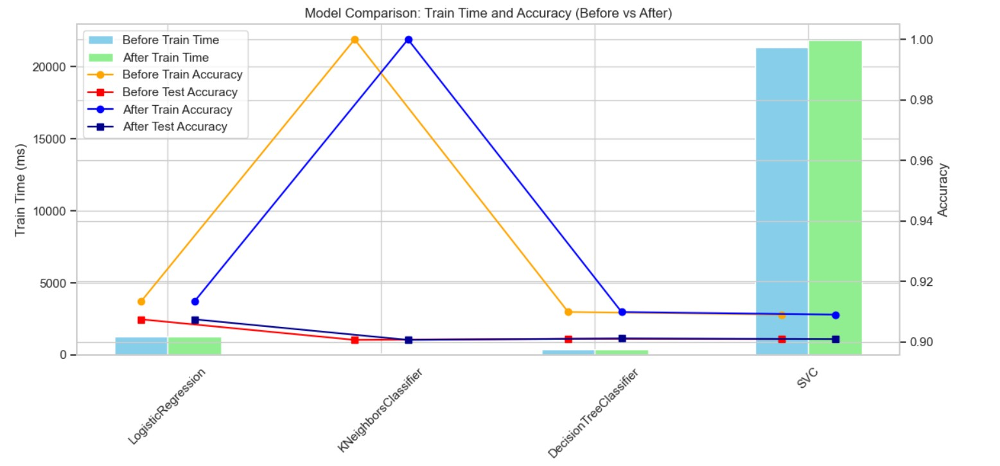

# [Jupyter Notebook Link](https://github.com/nscys2025/B-AIML-PracticalApplication3/blob/main/prompt_III.ipynb)

### Analysis Goal
The goal is to compare the performance of the classifiers namely K Nearest Neighbor, Logistic Regression, Decision Trees, and Support Vector Machines.  A dataset related to marketing bank products over the telephone is used.  

### Used ML Techniques
- CRISP-DM Framework
    - Within CRISP-DM, followed the steps of business understanding, data understanding, data preparation, modeling and evaluation cycle and finally providng the deployment/report.

- Data Understanding - Data Observation Steps
    - Checked for data info, description, samples, and unique values and value counts first.

- Data Prepapration - Data Cleaning Steps
    - Checked the the data to see if there are any actual data value problems.
    - Using domain knowledge, saw if there are features that can be eliminated.
    - Checked for duplicates and remove. 
    - Checked for nulls and the data contained "unknown" values.  To train models with the "unknown" sample, use "unknown" as value instead of treating it as null.    

- Modeling - Used K Nearest Neighbor, Logistic Regression, Decision Trees, and Support Vector Machines modeles to compare performance 
    - Did preprocessing using following methods
        - *Used GridSearchCV and RandomGridSearchCV (for SVC) to find the best hyperparameters*
        - *Used PolynomialFeatures to transform Logistic Regression to higher degree polinomial combination to capture non-linear relationship*
        - *Used StandardScaler to scale numeric data*
        - *Used OrdinalEncoder to use ordinals for the features with ordinality for better understanding by ML*
        - *Used OneHotEncoder to make object features to numeric features for better understanding by ML*
    - Reduction of dimensionality and Clustering for ML efficiency
        - *Used PCA to reduce dimensionality*
    - Used Classifier models  
        - *K Nearest Neighbor*
        - *Logistic Regression*
        - *Decision Trees*
        - *SVC*

- Evaluation - Evaluation Steps
    - Recorded accurcy of the models for train data and test data.
    - Recorded the time to train the models.
    - Compared all models for train data accuracy, test data accuracy and time to train the model.
    - Also compared the data before using optimal hyperparameter values and after.
 
 - Deployment - Report

### Final Report

#### Goal
*The goal is to compare the performance of the classifiers namely K Nearest Neighbor, Logistic Regression, Decision Trees, and Support Vector Machines so the most efficient (less resource and faster training with highest accuracy) model can be used to answer the question of how to optimally reach out to customers over the phone marketing back products.*

#### Findings
*Whether before or after hyperparameter optimization, Logistic Regression model turns out to be the best in terms of accuracy and while other models, such as KNN and Decision Tree, were faster in training, Logistic Regresion wasn't overly slow given the current data.  So given that we have time and resource to accomodate Logistic Regression, Logistic Regression model is the best pick for this project* 

#### Recommendation
*For marketing bank product over the phone data, use Logistic Regression to classify whether the conssumer subscribed to a long term deposit*